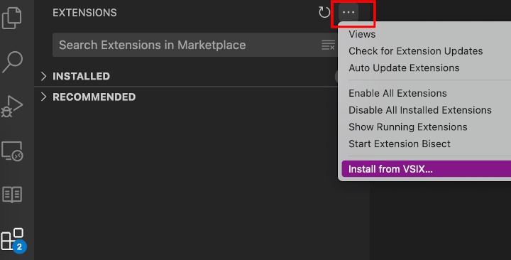

# ScriptIQ: AI-powered Mobile App Testing for Visual Studio Code

**Test mobile apps without writing code!**

ScriptIQ is a Visual Studio Code extension that empowers you to test mobile applications on real devices using natural
language. Simply describe the goal you want to achieve within your app, and ScriptIQ's powerful AI engine will
automatically navigate the app and reach your desired outcome.

**Boost your mobile app testing efficiency with ScriptIQ:**

- **Intuitive Testing:** Describe your test goals in plain English, making mobile app testing accessible to everyone.
- **AI-powered Automation:** ScriptIQ leverages AI to intelligently interact with your mobile app, mimicking real user behavior.
- **Real Device Testing:** Validate your app's functionality directly on real mobile devices, ensuring a true-to-life testing experience.

**Who is ScriptIQ for?**

- Mobile app developers and testers of all skill levels.
- QA professionals looking to automate mobile app testing.
- Anyone who wants to test mobile apps on real devices without writing code.

**Getting Started with ScriptIQ:**

🚦 ScriptIQ is currently in closed beta!

1. Download and install the ScriptIQ extension (`.vsix`) from [the release page](https://github.com/saucelabs/vscode-scriptiq/releases).
2. From VSCode's main menu, select "Extensions".
3. Click the `...` (View and More Actions) button at the top of the middle panel.
4. Select "Install from VSIX..." and follow the prompts.
   
5. Upload your mobile app file via [Sauce Labs App Management](https://app.saucelabs.com/app-management).
6. Click ScriptIQ icon in Activity bar.

   

7. Input and save credentials (do this once, unless new credentials are necessary).
8. Describe your test goal in plain English.
9. Click "Generate Test" to let ScriptIQ navigate your app on a Sauce Labs real device.
10. Review the test results and iterate on your test goals as needed.

For more installation details, please check [here](https://code.visualstudio.com/docs/editor/extension-marketplace#_install-from-a-vsix).

ScriptIQ brings the power of AI to mobile app testing, making it easier, and more accessible than ever.

For more information and documentation, please visit the ScriptIQ documentation (coming soon).

## Prompt Generation Hints

ScriptIQ is powered by Large Language Models (LLMs). LLMs are very powerful, but sometimes it takes a couple of tries to create a prompt that the model can understand and interpret correctly. Therefore it might take multiple attempts to write a goal which generates the expected test. If your first attempt does not result in the desired outcome, and you are unsure why this is, you can refer to these potential issues with your prompt:

- **Unclear word choice**: Consider whether or not the goal you created could be interpreted in multiple ways. If so, consider rewriting or adding clarifying statements.
- **Incorrect path taken**: ScriptIQ uses common sense reasoning to generate the test using the intent of your goal. But sometimes ScriptIQ takes the wrong path, making an assumption about the best way to accomplish your goal which is incorrect. When an incorrect step is taken, consider defining the correct action explicitly in your goal. For example, if ScriptIQ attempts to login when you do not require it to login, you can add "do not login" to your goal.
- **Context provided in assertions**: The assertion statements do not guide ScriptIQ towards accomplishing the goal, they only check whether or not the descriptions provided in the assertion match seen screens. If you've only included necessary context in the assertion fields you'll need to add it to the goal.
- **Non-journey based goal**: ScriptIQ is based on GUI interactions, it cannot reference the source code, so goals which refer to the source code might not be understood.

Here is an example of updating your goal:

1. Create your first, general goal: 
2. You can see that it did not accomplish the goal of logging in because it scrolled down when the option to login is brought up when you click "More".
3. Update the goal with this additional context and run again: 
4. The updated goal is now accurately finding the login button and clicking it.

Those are just some examples of why a goal might not work and how to fix it. Feel free to be creative!

## How Do Assertions work?

Once you've started generating tests, you might want to more quickly determine if your test succeeded or failed, this is where the _Assert Inputs_ fields come in. Assert Inputs are descriptions of screens which are used to evaluate the test generated. When assertions are provided, the LLM will determine if the assertion matches what is on the screen for each assertion provided against every screen visited. These assertions can describe the entire screen (e.g. login screen) or describe an element on the screen (e.g. page with checkout button). These assertions are _not_ used to generate test steps, any intent needed to drive the test generation must be included in the _Test Goal_ field. Below you can see examples of assertions and an example output.

Example of Assertion Inputs:

Example of Assertion Results:

